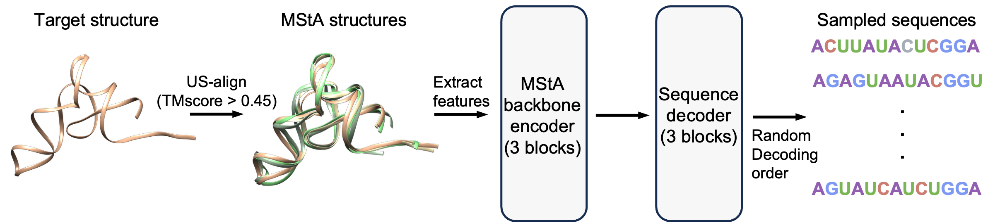

# AlignIF

AlignIF is a deep learning framework for **functional RNA design** that integrates 3D structural constraints with evolutionary principles from Multiple Structure Alignments (MStA). It enables biologically plausible RNA sequence generation while preserving structural functionality.

## Data and Model Checkpoint

Please download the data and model checkpoint from [Google Drive link](https://drive.google.com/drive/folders/19esX7wAMY5G2eWIDQrpq2Od4lOM2PKeA?usp=drive_link) and then put all files into the current folder.

## Installation

First, download the repository and create the environment.
```
git clone https://github.com/sfwang-auto/AlignIF.git
cd ./AlignIF
conda env create -f environment.yml
```

AlignIF relies on the US-align. You can install US-align using the following command.
```
git clone https://github.com/pylelab/USalign.git
cd USalign
g++ -static -O3 -ffast-math -lm -o USalign USalign.cpp
```

Note: We have tested the environment on Ubuntu 20.04.6 and CUDA 12.4. If you are using a different CUDA version, please install torch and torch-geometric according to the corresponding CUDA version.

## Usage

You are required to input the structure file (.pdb or .cif) of the RNA structures. AlignIF will subsequently output the designed sequences (`outputs`). 

```
python src/inference.py --input_structure_path ./example.pdb --n_samples 1 --use_msta True --temperature 0.1
```

Furthermore, you can specify the max number of alignment (the MStA depth).

```
python src/inference.py --input_structure_path ./example.pdb --n_samples 1 --use_msta True --max_n_aligns 50 --temperature 0.1
```

## License
This project is licensed under the [CC-BY-NC-4.0](LICENSE).

## Online service
We also provide online service [http://www.csbio.sjtu.edu.cn/bioinf/AlignIF](http://www.csbio.sjtu.edu.cn/bioinf/AlignIF/).
